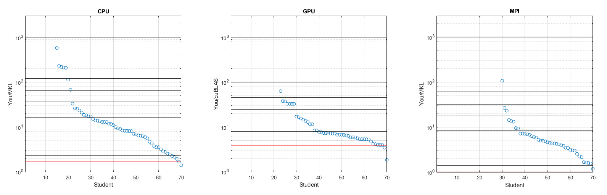

# Assignment

This assignment implements fast multiplication of large square matrices using all of: serial techniques, AVX, openMP, MPI and CUDA. Most of the files present were provided in a complete state, except:

- `matrixMultiply.cpp`: contains serially-optimised + AVX + openMP solution

- `matrixMultiplyGPU.cu`: contains CUDA solution

- `matrixMultiplyMPU.cpp`: contains MPI solution

## Results

All three solutions received full marks. In detail, the marking script output was:

```
CPU[1,2|4/4](AMD EPYC 7542 32-Core Processor ) 2048 11.045 6.495 1.701 2.362e-08 7.00
GPU[0,2|0/1](GRID A100-2-10C MIG 2g.10gb) 2048 276.443 148.334 1.864 0.000e+00 7.00
MPI[0,2|4/4](vgpu10-0.compute.eait.uq.edu.au) 2048 12.368 10.707 1.155 2.362e-08 7.00
```

This can be interpreted per the COSC3500 Assignment specification (from 2023). A cohort grade summary was also provided, which can be compared with the numbers above: 1.701, 1.864 and 1.155, respectively. The red lines represent Joel Carpenter's (the course coordinator) reference solution. CUDA performance is particularly notable (if I do say so myself!).


